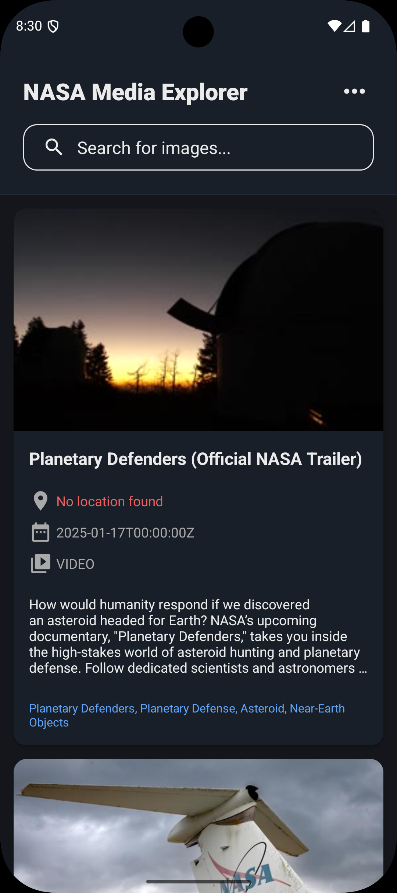
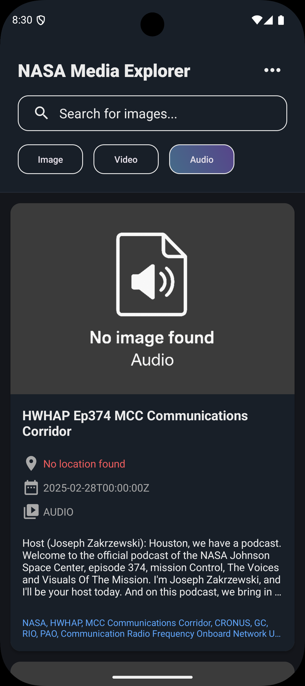
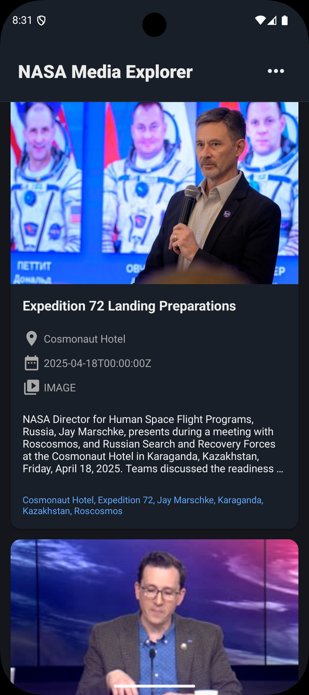
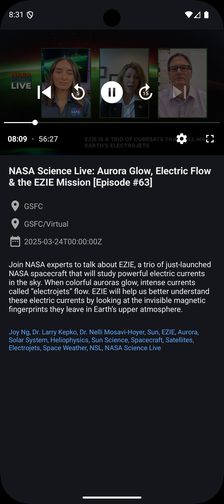
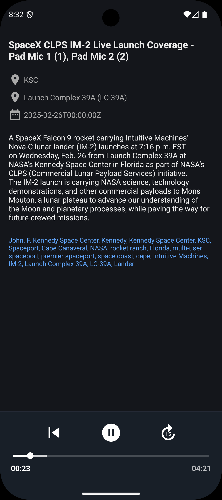
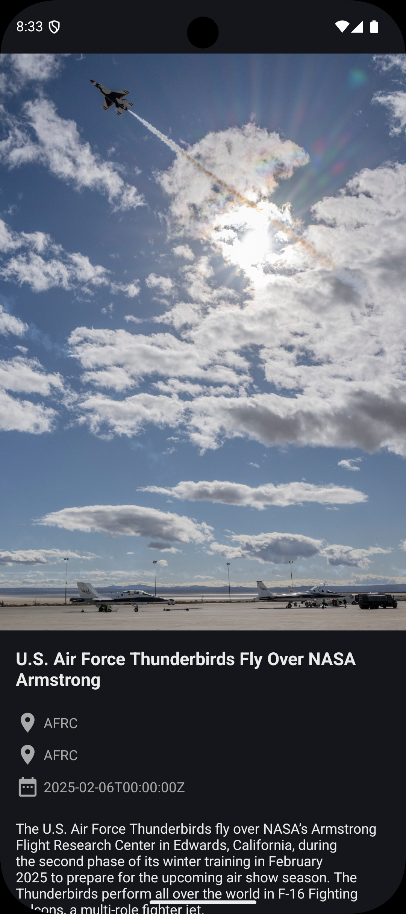
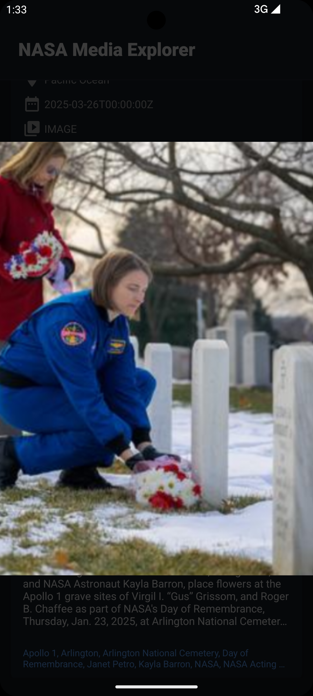
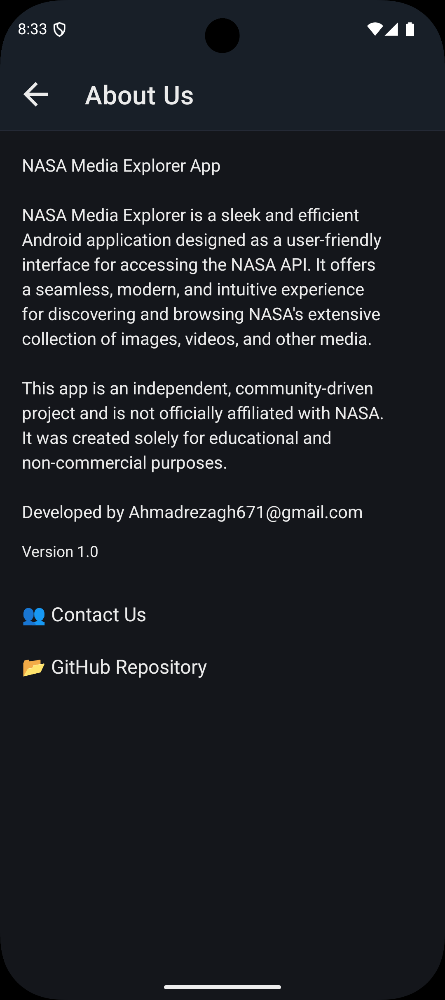

# NASA Media Explorer
[](https://github.com/ahmadrezagh671/NASA_Media_Explorer/releases)

NASA Media Explorer is an open-source Android application that allows users to explore NASA's vast Image, Video, and Audio Library in a user-friendly interface. The app leverages NASA's public API to provide a seamless experience for discovering and interacting with space-related media content.

## Features
- **Search**: Use a SearchView to browse NASA's media library.
- **Filter Media Types**: Filter results by media type (Image, Video, Audio).
- **Video Playback**: Play videos with caching using Media3 ExoPlayer.
- **Audio Playback**: Play audio files with MediaSessionService for background playback.
- **Image Zooming**: Pinch-to-zoom functionality for images using the Zoomy library.
- **Pull-to-Refresh**: Refresh media lists using SwipeRefreshLayout.
- **Responsive UI**: Built with RecyclerView, CardView, ConstraintLayout, and LinearLayout for a smooth user experience.

## Screenshots
Below are some screenshots showcasing the app's interface:

|  |  |  |  |
|-----------------------------------------|-----------------------------------------|-----------------------------------------|-----------------------------------------|
|  |  |  |  |

## Dependencies
The app uses the following libraries:
- **Volley**: For making HTTP requests to NASA's API.
- **Gson**: For parsing JSON responses from the API.
- **Glide**: For efficient image loading and caching.
- **SwipeRefreshLayout**: For pull-to-refresh functionality.
- **Zoomy**: For pinch-to-zoom functionality on images.
- **Media3-ExoPlayer**: For video playback with caching.
- **Media3-UI**: For ExoPlayer UI components.
- **Media3-Session**: For audio playback with MediaSessionService.

## Components Used
- **SearchView**: For searching NASA's media library.
- **SwipeRefreshLayout**: For refreshing media lists.
- **RecyclerView**: For displaying media items in a scrollable list.
- **CardView**: For styling media items.
- **ConstraintLayout & LinearLayout**: For responsive layouts.
- **Service**: For background audio playback via MediaSessionService.
- **CacheDataSource**: For caching video content in Media3.
- **CircularProgressDrawable**: For loading indicators in SwipeRefreshLayout.

## Installation
1. **Clone the repository**:
   ```bash
   git clone https://github.com/ahmadrezagh671/NASA_Media_Explorer.git
   ```
2. **Open in Android Studio**:
   - Open Android Studio and select `Open an existing project`.
   - Navigate to the cloned repository folder.
3. **Build and Run**:
   - Sync the project with Gradle.
   - Build and run the app on an emulator or physical device (API 28+).

## License
This project is licensed under the MIT License. See the [LICENSE](LICENSE) file for details.

## Acknowledgments
- [NASA Open APIs](https://api.nasa.gov/) for providing access to their media library.
- The open-source community for the amazing libraries used in this project.
